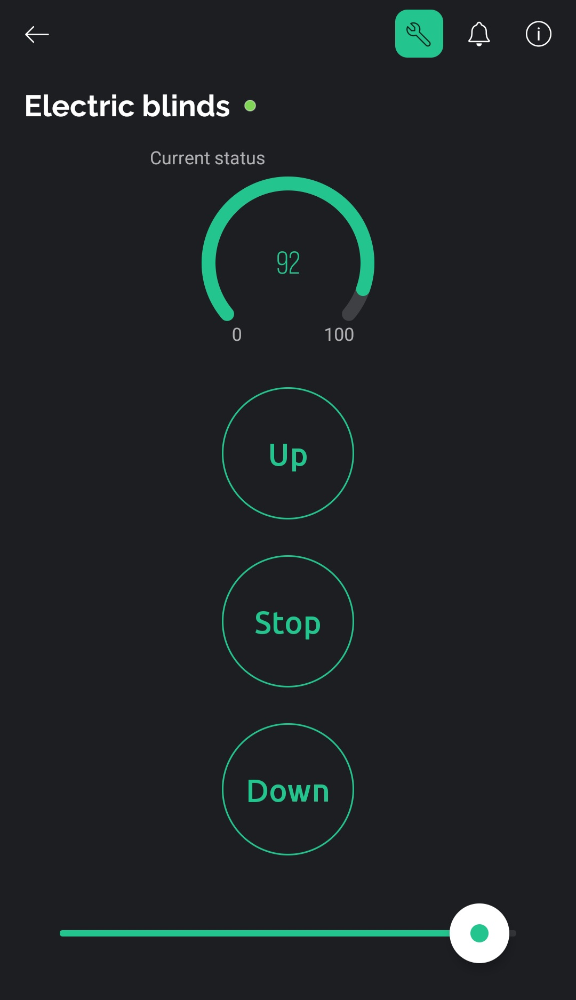

# Electric-Blinds-v2

Hardware and software for the first version were made quickly because the focus was on 3d printing gears. When the gears and transmission proved to be very good, I decided to make a better software for ESP that will add more controls and features. [Here is demo video of v1](https://www.instagram.com/p/C6BQB3ug1dN/).

## Features

| V1 | V2 |
|-----|-----|
| Single-core (Esp8266) | Dual-core (ESP32) |
| - | Current blinds level preview |
| Move full up / full down | Put blinds in the desired position |
| - | Stop at any position |

It uses both ESP32 cores to control the stepper motor in real time over the internet. One core runs Blynk while another runs the stepper motor.

## Settings

In the `src/settings.h` you can adjust everything you need for the project. Be careful about `STEPPER_MAX_SPEED` and `BLYNK_REFRESH_INTRERVAL`. Don't put high speed and too high refresh rate in the application.

## Blynk datastreams

| Pin | Usage |
| --- | --- |
| V2 | Virtual pin for UP button |
| V3 | Virtual pin for DOWN button |
| V4 | Virtual pin for STOP button |
| V5 | Vurtual pin for percenatge gauge |
| V6 | Virtual pin for slider (wanted percentage) |

## Parts

* [3D printed parts](3D-printing-files/stl)
* Nema 17 stepper motor
* A4988 stepper motor driver
* ESP32 NodeMCU
* 624zz ball bearings
* M4 bolts as well as nuts and threaded rod
* M3 bolts
* Grease

## todo

* Dodati sync na pocetku programa i ocitanje iz EEPROM-a
* Dodati senzor napajanja i ako nema napajanja spremiti trenutnu poziciju u EEPROM
* Nacrtati i dodati shemu + custom PCB?
* Sleep (disable stepper driver) kad je esp aktivan a roleta miruje. (vecinu vremena je tu pa treba da se ne grije i da se ne trosi puno struje)
